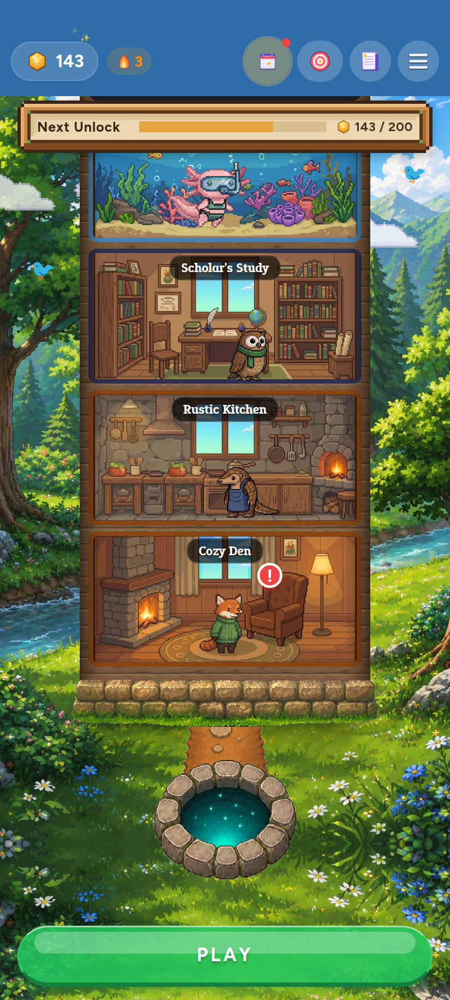
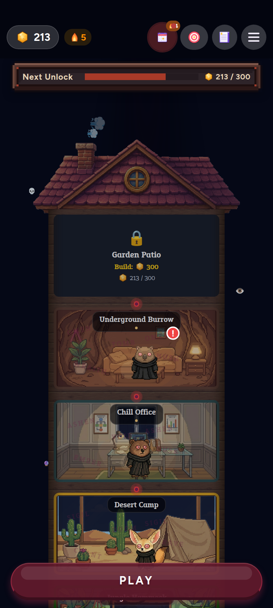
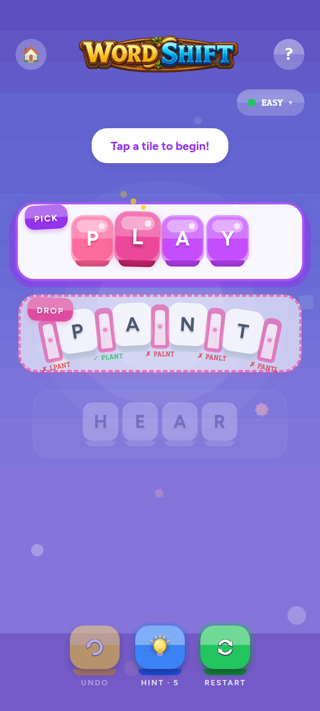
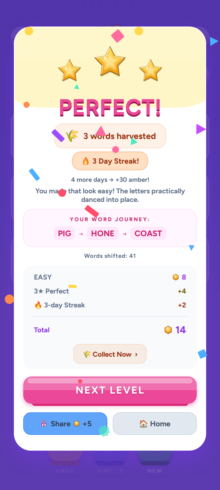
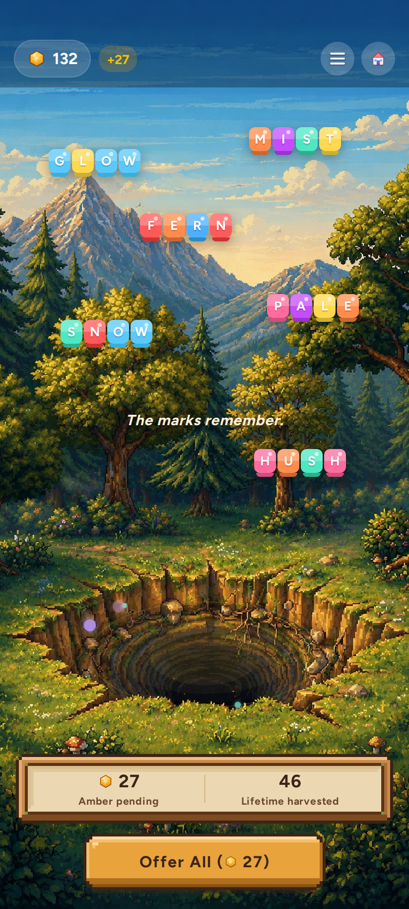
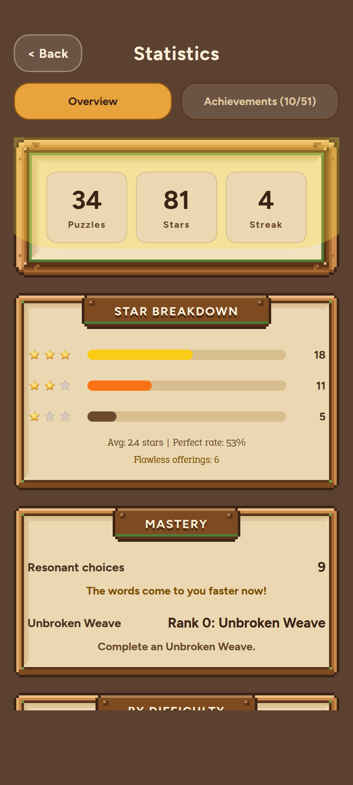
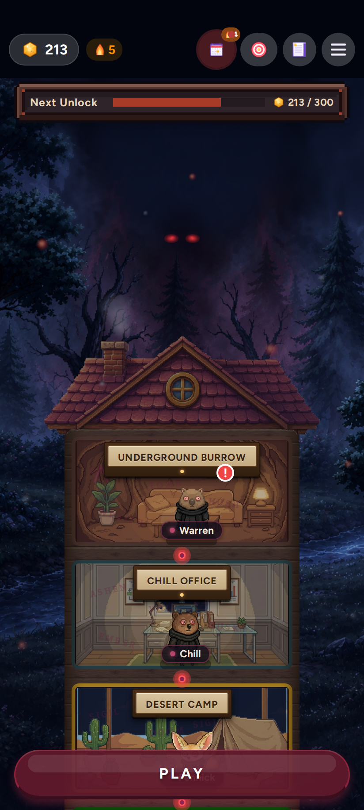
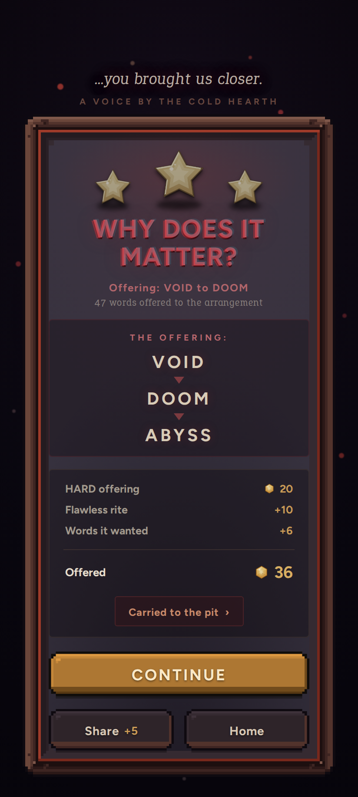
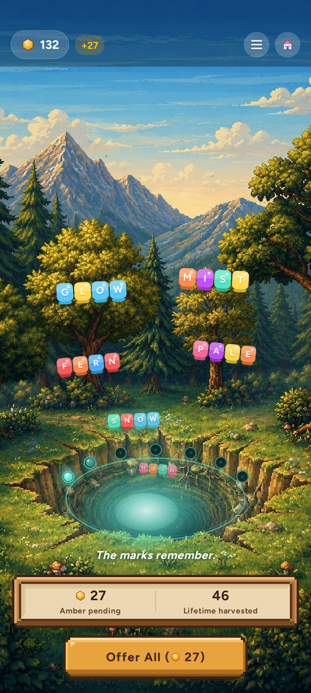

# WordShift — AAA Design Audit

**Date:** 2026-07-21 · **Branch:** `claude/wordshift-design-audit-fg52kd` · **Scope:** design/experience audit only, no game code changed.

**The bar:** Monument Valley II, Alto's Odyssey, Two Dots, Royal Match, Cult of the Lamb, NYT Games. The question asked of every system: would it survive a frame-by-frame comparison with those titles on a mid-tier Android phone?

---

## 0. Implementation status (verified line-by-line)

> The audit was the first deliverable; the branch then implemented it across the follow-up sessions (Sessions 2–5b), and the resulting status was **re-verified adversarially** — blind per-finding reviewers re-checking all 180 filed findings at their cited `file:line` against the shipped HEAD (default stance: *not done without proof*). The full per-finding table and the session-by-session reconciliation live in **[`AAA_IMPLEMENTATION_LEDGER.md`](./AAA_IMPLEMENTATION_LEDGER.md)**.

**Verified totals (of 180 filed findings), per the ledger's Totals after Sessions 2–5b:**

| Status | Count | Share |
|---|--:|--:|
| ✅ done | 174 | 97% |
| 🟡 partial | 3 | 2% |
| ⏸️ deferred | 3 | 2% |
| ❌ not addressed | 0 | 0% |

The ledger's reconciliation is the authoritative status — the remaining 6 are its **"honest remaining"** set: 3 partials (**F1** cross-row flying ghost, **F37** robed Phase 4-5 talk frames, **F138** the full app-wide `useWindowDimensions` sweep) and 3 deferrals (**F135** room-background pan-windowing, **F132** real on-device Play screenshots, **F148** store screenshot #5 re-capture), each held with a concrete stated reason rather than shipped blind.

---

## 1. How to read this audit

**Method.** Thirteen parallel per-system auditors read the code and assets first (docs were treated as unverified claims — correctly, since they still describe fonts the game no longer ships). Every finding was then re-read at its cited lines by an independent adversarial verifier whose default stance was *refuted*; findings could survive as CONFIRMED, be corrected in place (ADJUSTED), or die. A completeness critic then swept for uncovered ground across two rounds, growing coverage from the 13 mapped systems to **25 surfaces**. Separately, six pixel-accurate HTML recreations of shipped screens were built from the real assets and fonts and screenshotted headlessly — the render evidence in §3 is derived from code, not from imagination. Final verification stats: **180 findings filed, 179 surviving (1 refuted), 112 confirmed verbatim, 67 adjusted** (adjustments usually *sharpen* evidence or add feasibility caveats, not weaken claims).

**Three tests, applied per system:**
- **Screenshot Test** — would a random frame sell the game?
- **GIF Test** — does any moment beg to be clipped and shared?
- **Hands Test** — does it feel alive in the first 60 seconds of touching it?

**What is sacred** (identity, not doc dogma — every recommendation amplifies these, none flattens them): the cozy→cosmic-horror descent across phases 0–5; *feel it before being told*; spoiler-safe shares and dailies; the entity is never named; the player never sees a phase label.

**Engineering reality is binding:** everything proposed below is native-driver (transform/opacity), Fabric-safe, `reducedMotion`-and-device-tier gated, and judged against a low-end Android phone.

---

## 2. Executive verdict

WordShift today is a game with **AAA bones wearing mid-market clothes in exactly the places players look longest**. The tile idle/selection feel, the phase-lighting model, the cottage panel kit, the pit devour spiral, the audio architecture, and the asset discipline are genuinely at or near the bar — several systems would pass a Monument Valley bar review untouched. What keeps the whole from reaching the bar is concentrated in three structural gaps and a long tail of unfinished wiring:

1. **The animals are not alive.** One walk cycle among thirteen animals; a single cloned breathe for every species; no blink, nap, stretch, or reaction anywhere; dialogue is a 300ms metronome mouth-flap over instantly-dumped text; "sleeping" animals pace their rooms; and a coin-flip `scaleX:-1` renders name tags and badges **mirror-imaged**. The game's emotional core — *you should like these animals* — is carried entirely by static art.
2. **The most-repeated ceremonies never age.** Victory springs, star haptic rhythm, confetti physics, toasts, and modal entrances keep bright-candy body language from phase 0 through the reveal, while the tiles around them heavy-up on a six-parameter phase ladder. The game's own best pattern (LetterTile) proves the doctrine; the ceremonies ignore it. And the single most important cinematic in the game — the entity's arrival — sits on a clearable 1.5-second timer that a habitual fast exit **cancels forever** (the completion flag persists first).
3. **A finished game is still standing in for its own placeholder in dozens of places.** OS color emoji serve as ambient world FX (💀/👁 float over hand-painted skies), emote bubbles, ceremony hero art, achievement icons, and the crash screen; five authored celebration sounds ship in the binary with zero call sites; the home ambient particle system renders **behind the opaque sky**; six secondary screens have zero animation while the design system ships an unused stagger token.

None of this is a rewrite. The audit found the delight ceiling is high precisely because the hard systems — phase theming, 9-slice cottage materials, synth pipeline, sprite discipline, native-driver hygiene — already exist. Most of the roadmap is *finishing wiring* and *extending proven patterns to the surfaces that missed them*.

### Scorecard (1–10 against the named bar)

| System | Screenshot | GIF | Hands | Overall | One-line verdict |
|---|---|---|---|---|---|
| Core board feel | 7 | 5 | 8 | **6.5** | Idle/selection layers are AAA; the commit — the core verb — is an un-animated state swap |
| House world | 6 | 4 | 5 | **5.5** | Gorgeous static composite; not a living diorama (particles occluded, zero parallax, emoji actors, no pan physics) |
| Animal life & rooms | 5 | 5 | 6 | **5.0** | Complete sprite sets + one real walk cycle; everything else is one cloned breathe and mirrored chrome |
| Victory ceremony | 6 | 5 | 7 | **5.5** | Honest economy + great skip craft; generic white card, phase-blind choreography, whisper hidden behind the modal |
| World ceremonies (pit/phase/finale/daily) | 6.5 | 6 | 6.5 | **6.0** | Best motion architecture in the game, half its sensory layer unwired (ceremony sounds never called) |
| Dead screens (Stats/Ledger/Gallery/Shop/Season/Difficulty) | 6 | 2 | 4 | **4.0** | Handcrafted materials, zero motion: unfinished-static wearing calm-crafted clothes |
| Emoji-vs-sprite consistency | 5 | 4 | 6 | **5.0** | Puzzle screen nearly clean; the painterly home world floats OS emoji as its FX layer |
| Motion vocabulary | 7 | 6 | 8 | **7.0** | ~510 animations, 100% native-driver; the aging rule superbly executed at the core, abandoned at celebrations |
| Audio & haptics | 6 | 5 | 8 | **6.0** | Board loop is near-AAA multimodal; the climaxes above the board play in silence |
| Typography, color, a11y | 7 | 7 | 6 | **6.5** | Near-AAA architecture; contrast collapses exactly where hands spend the first hour |
| Choreography integrity | 6 | 7 | 7 | **5.0** | AAA-adjacent choreography sitting on clearable timers and z-order mistakes |
| Asset base | 8 | 7 | 7 | **7.5** | A coherent, sellable painterly-pixel family; the strongest single system in the audit |
| First 60 seconds | 7 | 5 | 6 | **6.0** | Store-quality stills; a stuttery, unchoreographed lived sequence |

**Weighted read:** the game's *materials* (assets 7.5, motion hygiene 7.0, type/color architecture 6.5) outscore its *moments* (dead screens 4.0, animal life 5.0, victory 5.5). That inversion is the audit in one sentence: the studio-quality raw ingredients are assembled into under-rehearsed scenes. The roadmap in §5 is ordered to fix the moments using the materials that already exist.

---

## 3. Render evidence (current state)

Pixel-accurate HTML recreations built from the shipped assets, fonts, and code-derived geometry, captured at 412×915 @2x. Each caption lists what the frame *proves*. Full fidelity notes (every approximation disclosed) live with the render generators; nothing shown here is speculative — layout, colors, and states were derived from cited code.

### 3.1 Home world, phase 0 — `renders/current-home-p0.png`

The panned-down view of the bright-days home. **Proves:** the painterly world and room interiors are store-quality (the audit's strongest material); animal name tags are clipped invisible by the rooms' `overflow:hidden` (every companion is anonymous on the main screen); the `!` dialogue badge floats mid-room, detached from Ember; room nameplates are generic dark pills rather than the cottage kit's wooden plaques; the header is flat translucent-black chrome over hand-painted art; the roof (and its smoke) is cut off at this camera.

### 3.2 Home world, phase 4 — `renders/current-home-p4.png`

The launch-default camera (fresh sessions resolve the pan to `maxPanY` — the roof view). **Proves:** the upper third of the reveal-era home is featureless near-black (the bottom-anchored sky art sits below the viewport at this pan; the flat backdrop color fills the rest); the shadow figure — the game's marquee horror visual — is imperceptible at 0.5 opacity over near-black with its crimson eyes cropped above the frame; ambient dread "particles" are literal 12px 💀/👁 OS emoji; the locked-room card is a flat dark box with an emoji-grade padlock; bright candy header icons (🎯 red target, purple journal) never age. The robed sprites, faint word echoes, and dark cottage Next-Unlock bar genuinely land.

### 3.3 Puzzle board, phase 0 — `renders/current-board-p0.png`

Mid-move on the curated opener (letter lifted, graded previews showing). **Proves:** the candy tiles hold up frame-by-frame (bevel, gloss, per-letter color); the ✓/✗ preview words clip at row edges and collide with the slot pillars at the game's most-viewed location; an EASY board leaves ~40% of the screen as empty violet void below the future row; the home button is an emoji 🏠 chip beside the hand-painted wooden wordmark; the disabled UNDO state is a muddy brown slab.

### 3.4 Victory modal, phase 0 — `renders/current-victory-p0.png`

A settled 3-star win. **Proves:** the game's most-repeated ceremony surface is a generic flat-white rounded card — the 275-piece cottage kit never reached it; confetti renders **on top of** the modal text (zIndex 1000 vs 500 — a piece sits mid-word in the render exactly as the code layers it); emoji stand-ins (🌾🔥🏠) carry the receipt rows; the blue Share button is off-palette next to the pink primary.

### 3.5 Offering pit, phase 1 — `renders/current-pit-day.png`

Two batches waiting, one ward lit. **Proves:** the pit environment art is the single best Screenshot-Test frame in the game; the seven ward marks — the phase-progress anchor — are functionally invisible (unlit = 6% white over busy art; the lit ward's glow is iOS-shadow-only, so Android renders a flat dot); the pit-mouth glow at phase 1 is a stack of hard-edged ellipses at ~7% opacity; the floating offering words scatter into the sky with no gravitational relationship to the mouth that is supposed to devour them; there is no screen title (`getPitScreenTitle` exists and is never rendered).

### 3.6 Stats screen (dead-screen exhibit) — `renders/current-stats-dead.png` + `renders/current-stats-dead-achievements.png`

**Proves:** the cottage materials make a static frame look handcrafted (plaques, parchment, 9-slice wood); nothing on the screen ever moves (zero `Animated` usage in the file); the hero panel's glow blob paints *over* the wood frame like a rendering defect; achievements are iconed with raw emoji and locked rows are literal 🔒 characters; a phase-5-gated mode ("Rank 0: Unbroken Weave") leaks into a phase-0 player's MASTERY card; BY DIFFICULTY omits MEDIUM_PLUS so its counts don't sum to the hero total.

*"After" mocks for the top three proposals are in §6.*

---

## 4. Findings ledger

179 findings survived verification across 25 surfaces (1 refuted; 112 confirmed, 67 adjusted — adjustments almost always *tighten* evidence). Severity distribution: **5 P0, 53 P1, 84 P2, 37 P3**. The 13 mapped systems (§4.1-4.3) produced the 127 findings the report analyzes in full; two completeness-critic rounds then added 12 more surfaces and 52 findings (§4.4-4.5). Every entry is anchored to `file:line` and carries a concrete target state.

Severity key: **P0** = a bug or defect that actively damages delight or identity right now; **P1** = a major gap a first-session player would feel; **P2** = a real polish gap; **P3** = nice-to-have.

### 4.1 The five P0s — fix these regardless of anything else

**P0-1 · The game's climax cinematic can be cancelled forever by a habitual tap.** `App.tsx:2340/2377` persist `markFinalPuzzleCompleted()` / `markPostRevelation()` *first*, then queue `FINAL_PUZZLE_EVENT` (the 32-second in-engine shadow-descent — "The Arrival" that 90+ puzzles build toward) on a 1500ms victory timeout (`App.tsx:2347/2382`). Every victory exit — Next Level (`3286`), Home (`3332`), Collect-Now→pit (`3349`) — runs `startVictoryExitFlow`, whose first act is `clearVictoryTimeouts()` (`App.tsx:1328`), killing the queued event. Because the completion flag already persisted, the next win takes the `finalDone` branch and the cinematic **never re-queues — it is lost for that save forever**. The window is trivially hit: the modal cascade finishes ~950ms, one tap anywhere skips it, and the finale win dangles a "Collect Now" CTA. *Target:* set a `pendingEndgameEventRef` synchronously at queue time; in `startVictoryExitFlow`, if set, call `setPhaseTransitionEvent(ref)` immediately instead of dropping it (the overlay renders at App root above every screen, `App.tsx:4597`, so it plays mid-navigation); belt-and-braces, persist the queued event beside the flag so a kill replays it next launch. Effort: hours. *(verified CONFIRMED)*

**P0-2 · Every animal's name renders mirror-imaged roughly half the time.** The facing-left flip animates `scaleX:-1` on the sprite container (`AnimalSprite.tsx:636`), and that same transformed `Animated.View` wraps *every* child — shadow, body, emote bubble, `!` badge, cooldown text, and the **name tag** (`AnimalSprite.tsx:795`, tags at `916-930`). `scaleX:-1` persists through the 3-8s idle pauses, so about half the time each companion's name is backwards, and the tag additionally breathes 5%, tilts ±2.5° and squashes with the gait. On the game's flagship screen, the characters you are meant to love are labelled in mirror-writing. *Target:* restructure the render tree — position transforms on the outer container, a `body` wrapper carrying `scaleX`+breathe+wiggle+gait around ONLY the shadow and sprite, and name tag / badges / bubble as unflipped, untransformed siblings above it. Effort: hours. *(verified CONFIRMED)*

**P0-3 · The per-win narrative whisper renders underneath the victory modal.** `AnimalWhisper` fires 1200ms after every gated win (`timing.ts:11`) while the modal is up, but its container has no `zIndex` (`AnimalWhisper.tsx:120`) versus the modal overlay's `zIndex:500` (`VictoryModal.tsx:1310`) with a 0.7–0.85 opaque scrim — so the whole 364-line whisper corpus, including the personalized Phase-5 endgame lines, plays dimmed-to-invisible. Worse, `recordWhisper` still archives every unseen line as "collected" in the gallery. The interjection overlay got `zIndex:500` to fix exactly this; the whisper never did. *Target:* add `zIndex:501` (+ Android elevation) so it layers above the scrim like the interjection already does; optionally add an 8dp upward drift so the ghost "rises." Effort: hours. *(verified CONFIRMED)*

**P0-4 · Phase-transition ceremonies play in total silence while their sound ships unused.** `soundPhaseChange()` (`audio.ts:337`) — a bespoke 2.6s ritual swell, tied for the longest SFX in the pack — has **zero call sites** anywhere. The ward-ignition ceremony and the entire `PhaseTransitionOverlay` cinematic run on haptics and visuals alone, while the *old* phase's brighter music bed keeps looping underneath (nothing calls `stopMusic` on the ceremony path). The one moment the descent should become audible is mute. *Target:* fire the swell at the ward eruption (`OfferingPitScreen` ~`1575`) via the guarded `uiSound` bridge, stop the old bed on ceremony start (the existing effect restarts the new phase's bed when `phaseTransitionEvent` clears). Effort: hours. *(verified ADJUSTED — core confirmed, delivery path sharpened)*

**P0-5 · The Android app icon crops off its own word-game identity.** `icon.png` and `adaptive-icon.png` are byte-identical (`md5 7fcab4b5`): a full-bleed 1024² composition with ~185px rounded corners baked in as opaque near-black. Android masks the adaptive foreground to the centre ~66%, so on a stock circle launcher the fox's ears, the **W/S candy tiles, and the amber gem** — everything that says "word game" — are cropped, leaving an anonymous fox; the baked dark corners also risk peeking under square OEM masks. *Target:* author a true adaptive foreground (identity elements recomposed inside the 682px safe circle) + separate background layer; re-export `icon.png` full-bleed with corners extended, not baked. Effort: art (one recomposed foreground + background + clean splash). *(pending verify; hand-confirmed against `processAppIcon.mjs` + `app.json:40`)*

### 4.2 P1 findings by system (full detail)

Each P1 is the kind of gap a first-session player registers as "this isn't quite a top-tier game." Grouped by system; every one carries `file:line` evidence and an implementable target.

**Animal life & rooms** — the system furthest from the bar.
- *Sleeping animals sleepwalk.* The wander loop (`AnimalSprite.tsx:609-673`, deps `[animal.type]` only) never checks `isOnCooldown`, so a "sleeping" animal paces its room with three animated Z's and a 💤 badge glued to its head. *Target:* gate the movement loop and gait on `isOnCooldown`, settle the sprite at a rest spot, slow the breathe to ~2600ms. Hours.
- *Robed cultists candy-hop at the reveal.* `walkActive`/`gaitActive` require `currentPhase < 4` (`389/402`) but the wander effect has no phase gate, so at Phase 4+ robed figures fall through to the legacy springy bounce — rabbit does 8px "big hops," even the fox drops to its 4px bounce — motion becoming *larger and faster* at the exact horror climax, contradicting the file's own "gliding reverence." No motion parameter is phase-aware. *Target:* add a phase scalar to the motion language (Phase 4+ replaces the bounce fallback with a 0-1px slow sine glide, doubles pause times, slows breathe to ~3000ms); add `currentPhase` to the wander/breathe effect deps. Hours.
- *Dialogue is a 300ms metronome mouth-flap with no text reveal.* `setIsTalking` toggles on a flat 300ms interval (`useDialogueFlow.ts:525`) while text appears instantly (no typewriter exists in `src`), so the portrait flaps idle/talk forever while you read, at one rate for the sloth and the rabbit alike. *Target:* per-character text reveal (~18-25ms/char, tap-to-complete, instant under reducedMotion) driving `isTalking = revealInProgress`; per-species flap cadence. The single highest-leverage "alive" upgrade to the core narrative surface. Days.
- *Phase 4-5 dialogue portraits are frozen* — robed frames have no talk variant, so the climax's biggest lines play over a static image. *Target:* ship `robed_talk.png` per animal (13×, 500², framing-identical, mouth subtly open mid-chant) and mirror the pre-mounted opacity-switch. Art.
- *Idle life is one cloned behavior* — an identical 1.05-scale breathe for all 13 species; no blink, nap, stretch, or per-species idle, and each animal's own `talk.png` is never used in-room. *Target:* a rare-idle scheduler (one beat every 20-45s, one animal at a time) built from existing frames + transforms — see the Ambient Animal Life spec in §5.4. Days.
- *Emote bubbles are raw OS emoji* including human scream-faces (😱/😰) on reverent robed animals at Phase 4. *Target:* tiny sprite emotes on a parchment mini-bubble; re-key Phase 4 from fear to reverence (candle/eye/void), split the tap pool by phase so Phase 3 keeps dread and Phase 4 goes serene. Art (12 emote sprites, 128²).

**House world.**
- *The ambient particle system renders behind the opaque sky and is invisible at rest* (`HouseWorld.tsx:1128` before the world subtree at `zIndex:10`), paying real cost — up to 9 particles × 4 native timings + a whole-tree re-render per spawn — for nothing visible. *Target:* move the `particles.map` inside `transformContainer` after the sky (scene-space) or after the pan handler with `pointerEvents:none` (screen-space). Hours.
- *The world is one rigid plane with zero parallax*, and sky/clouds/stars abandon the frame after ~230dp of pan, leaving flat hex-color void for most of a full-house pan. *Target:* split the scene into a camera-slow layer (`Animated.multiply(translateY, ~0.3)`) for sky+clouds+stars vs the house at 1.0; grow the sky box to cover the parallax range (with cover-zoom cap). Days. *(the `skyGeometry.test.ts` regex-pinned dims must be rewritten, not renumbered.)*
- *Ambient actors are platform emoji over painterly art* — chimney smoke is 💨, birds are 🐦, shooting stars are ⭐, particles include literal 💀/👁, and `cloud_1/2.png` are hollow lavender outline clouds over a sky with baked volumetric clouds. *Target:* replace every actor with small sprites in the painterly-environment family, keeping the existing native-driver animators. Art (smoke/bird/particle/cloud/star sprites — see §5.3).
- *The primary world gesture has no physics* — pan dead-stops on release, no momentum, no rubber-band (`homeScenePan.ts:2` hard-clamps). *Target:* feed `velocityY` into `Animated.decay` with a soft spring onto bounds; diminishing overscroll during drag. Hours.
- *Home celebration confetti is bright rainbow at every phase and ignores reducedMotion* — the Phase 3-4 unlock climaxes (Star Loft/Belfry/Sky Garden at 84/88/92, house completion ~96-100) burst party colors over the near-black world. *Target:* pass phase, source colors from `getPhaseTheme(phase).confettiColors`, gate on reducedMotion/tier. Hours.

**Victory ceremony.**
- *Choreography is completely phase-blind* — identical bright-bouncy star springs (friction 4/tension 120), 200ms stagger, and tap-tap-tap-THUD haptics from Phase 0 candy through the Phase 4 reveal, while the rest of the game speaks the phase-weight motion language and the design system already ships `getPressSpring(phase)`. *Target:* add `getCelebrationSpring(phase)` (0-1 `{4,120}` → 4+ `{9,80}`, the tiles' heavy settle), thread phase into `playVictorySequence`, heavy up haptics at Phase 4. Hours.
- *The victory toast queue renders under the modal and is destroyed on exit* (`zIndex:50` vs `500`) — every receipt (streak-milestone amber, hint grants, house-ask +15, freeze saves) plays as a parade of dimmed system messages behind the scrim; the code comment already concedes the surface is buried. *Target:* move victory-window receipts into the modal (a receipt slot under the amber breakdown, like the existing event-bonus line). Days.
- *The two scripted hush beats still fire celebration haptics* — `VictoryModal.tsx:308` fires `hapticSuccess()` unconditionally on modal open (including the finale and the silent-victory beat), and the silent win at puzzle 104 keeps the full tap-tap-tap-THUD; `skipToEnd` fires an unconditional `hapticHeavy`. The phone celebrates in the hand while the screen performs silence, breaking a documented "hushed haptics" contract. *Target:* thread one `hushed` flag through `VictoryData`; branch the haptic layer on it in all three places. Hours.

**World ceremonies.**
- *Every world ceremony is audio-dead* — `soundAmberEarn`/`soundUnlock`/`soundAchievement`/`soundDailyReady` all have zero call sites; the pit devour plays the menu tick. *Target:* wire the shipped pack at its moments; mint one devour whoosh. Hours.
- *The Arrival fires the game's lightest haptic via a fallthrough* — `fireSceneHaptic` has no `descend` case, so the single climactic scene falls through to `hapticLight()` (the letter-selection haptic), nothing marks the figure's landing, and the puzzle music loops underneath. *Target:* add a `descend` case (`hapticWarning` at start, `hapticHeavy` settle at `descendMs`), stop the bed, play the dark phase_change stinger on landing. Hours.
- *Declared cinematic direction never renders* — `pulse`/`particles_rise`/`particles_fall` are unimplemented no-ops (yet `fireSceneHaptic` fires haptics for them, so the player feels beats for invisible visuals), and the event-level `vignette:true` flag is dead, so the first two phase cinematics and the entire post-revelation cinematic are text cards on flat color. *Target:* implement the three effects native-driver; honor `event.vignette`. Hours.

**Dead screens.**
- *`DifficultyMenu` — the most-touched config surface — pops in and out with literally zero transition* (`animationType:"none"`, no `Animated`), while its folder-sibling `RulesModal` already implements the house entrance. *Target:* copy `RulesModal`'s backdrop-fade + `SURFACE.modalIn` spring. Hours.
- *Buying a 300-1000 amber cosmetic ends in a silent chip swap* — the game's biggest expression purchase has no celebration, and confetti palettes are sold as motionless dots (you buy a celebration and never see it celebrate). *Target:* burst the purchased palette on success, pulse the preview, make previews tap-to-demo. Hours.
- *Season Pass has no progress rail and no reward moment* — a battle-pass surface rendered as a text list with `' ✓'` appended on claim. *Target:* vertical filled rail + current-tier state + claim payoff + final-tier burst. Days.
- *The design system's own `SURFACE.staggerMs` cascade token has zero consumers* — every secondary screen materializes fully-formed behind a flat fade. *Target:* a shared `useEntranceCascade(n)` hook (leading with a ~180ms delay so the first card doesn't cascade behind the transition overlay) applied to the first 4-6 cards per screen; retrofit the two modal-choreography violators. Hours.

**Emoji consistency.**
- *The home-world ambient FX layer is OS color emoji* (👁/💀/🔮 over the storm sky, 💨 smoke, 🐦 bird, ⭐ shooting star) while the puzzle screen already solved this with tinted two-View shapes. *Target:* port `AnimatedBackground`'s renderShape material into `HouseWorld`. Days.
- *The descent's hero moments headline raw emoji* — the puzzle-header atmosphere badge, the phase-change card, the sacrifice altar candle (🕯️), and the house-completion ceremony (🌑/🏠). *Target:* one phase-mood sprite family consumed in both the badge and the card; `moon.png`/`eye.png` already exist. Art (4 icons, 256²).

**Motion vocabulary.** *(the governing principle these share, from the auditor: "the world ages, the hand does not" — world-state motion takes the phase ladder; touch-acknowledgment stays constant.)*
- *Victory star/modal springs are frozen at bright physics for the entire descent* (same root as the victory-choreography P1; the fix is `getCelebrationSpring(phase)`). Hours.
- *The PLAY dock (`JuicyButton`) runs a perpetual pulse ignoring reducedMotion and device tier*, with bright-fixed springs at every phase — the only always-on-screen loop that violates both mandatory rules. *Target:* gate the loop; phase-slow the period; `getPressSpring(phase)` on release. Hours.
- *`AmberSparkle` leaks five never-stopped recursive animations per mount* (the `useEffect` returns no cleanup) and ignores reducedMotion/tier/phase — the most-seen decorative motion in the game, festive white ✨ over the phase-4 near-black. *Target:* add cleanup + guards + phase aging (warm hue stays, festivity goes). Hours.

**Audio & haptics.**
- *The Offering Pit devour has no audio identity* — tap-to-devour plays the menu selection tick, the impact burst is silent, `amber_earn.wav` is preloaded but never played. *Target:* mint `pit_devour`(+`_dark`), play it at devour impact and on the Offer-All cascade cadence, `soundAmberEarn` at batch finalize. Days.
- *Achievement/unlock/daily-reward sounds shipped but were never wired* — the biggest purchases and the 7-day jackpot reveal happen in silence. *Target:* wire the three orphans; mint dark mirrors so Phase 3+ doesn't ring bright. Hours.
- *The horror layer is mute* — the guaranteed first-win glitch, the glitch-title micro-beats, and every animal whisper play with zero audio or haptic, while every menu toggle ticks. *Target:* mint two quiet horror sounds (`glitch`, `whisper`), pair with `hapticWarning`/`hapticLight` on prominent glitches and whisper reveal only; suppress on the finale-board silent contract. Days.

**Typography, color, a11y.**
- *Ghost word previews are strained-illegible* — the core judge-the-word channel computes 1.2–2.8:1 over the actual composite at every phase (worst on graded valid green: 1.18:1 at Phase 4). *Target:* render the preview word on a small dark rounded scrim chip with light ink (computes 4.8-6.3:1 across all phases); keep the no-leak one-ink neutral contract; add a WCAG unit test over the real compositing model. Hours.
- *The puzzle HUD chrome is 9-12px translucent-white text at 2.3-2.9:1 through the bright phases* — the entire first-session window runs sub-3:1, sub-11px. *Target:* back the statsRow chips with the shipped `getOverlayBannerTheme(phase).containerBg` (~9:1), raise floor sizes to 11px. Hours.
- *The puzzle loading box and Time's-Up overlay stay Phase-0 white candy at every phase* — the descent breaks whenever the game pauses (and speed unlocks at 55 solves, so most Time's-Up moments are in the dread phases). *Target:* swap to the phase-aware surface system + `CandyButton` variants (a container swap, not a new system). Hours.

**Board feel.**
- *A committed move reads as a state swap, not a physical move* — the moved letter re-mounts with a ±14px settle standing in for a ~124px cross-row journey, and every neighbor tile teleports ~29px via plain flexbox (zero `LayoutAnimation`/FLIP anywhere in `src`). The core verb, performed hundreds of times, is the least animated interaction in the game. *Target:* a native-driver ghost tile that springs across the measured gap (rows are already measured via `registerRowNode`), plus a FLIP on the survivors (with compact-threshold and arc-row caveats). Days.
- *The arc fan never closes with motion* — the 450ms open glide is the board's best motion, but commit/deselect swap the subtree out in one frame so the collapse runs against nothing, and switching letters hard-cuts the fan flat. *Target:* keep the arc mounted via local `arcVisible` state through the collapse; skip the `setValue(0)` flash on letter-switch; add the missing reducedMotion guard. Hours.

**First 60 seconds** *(pending verify; hand-checked against cited lines).*
- *Every launch blinks through a near-black Phase-4 screen and an unchoreographed home flash before the first board* — four visual worlds and three hard cuts in the first ~3 seconds, the near-black `initialLoadingContainer` on every launch. *Target:* one continuous branded hold (`#FFF0F5` loading, boot composition reused, cold-open first-paints puzzle not home, route the swap through `transitionTo`). Days.
- *The auto-shown invite modal buries Ember's "Hello up there!" payoff under a 70% scrim* — the first narrative signature moment is authored and unreadable. *Target:* sequence the two surfaces (delay the invite until the guide line has held ~4s, or merge them). Hours.
- *The board arrives with zero entrance choreography* — tiles pop in fully formed behind a spinner blink, while the code already knows the stagger pattern (drop slots stagger in). *Target:* per-tile staggered mount (scale 0.85→1, delay `(row*len+col)*~20ms`, <450ms, gated) + a 250ms loading grace. Days. The single biggest Hands-Test gap in minute one.

### 4.3 P2 / P3 tail (compact)

The 52 P2 and 27 P3 findings are catalogued in the appendix data; the recurring shapes, each with representative evidence:

| Theme | Representative findings | Fix shape |
|---|---|---|
| Aging holdouts | confetti physics never age (`Confetti.tsx:54`); `SURFACE.modalIn`/toasts fixed (`surfaces.ts:41`); board slot loops + wordmark bob + animal breathe keep Phase-0 tempo; attention pulses (`HouseWorld.tsx:804`); dread pulse blinks instead of stains (`timing.ts:29`) | thread phase into each spring/loop |
| Emoji tail | 51-achievement icons all emoji (`achievements.ts:65`); 7 chrome surfaces use emoji while the sprite exists in `assets/ui`; crash screen `😵` (`ErrorBoundary.tsx:47`); locked rooms 🔒 (`RoomView.tsx:410`) | swap to existing/new sprites |
| Dead-screen motion | Stats bars render at final width, no fill (`StatsScreen.tsx:505`); WhisperGallery accordion snaps (`WhisperGalleryScreen.tsx:179`); Ledger buries newest at the bottom of 500 static chips; Store amber changes are instant number swaps; no achievement progress-toward | entrance cascade + count-ups + progress bars |
| Ceremony polish | ward glow iOS-shadow-only on Android (`OfferingPitScreen.tsx:2398`); Offer-All cascade has no escalation shape; daily-login claim has no haptic/payoff; screen transitions one generic dip; Tending shrine unskinned | layered-View glow + escalation + phase transitions |
| Contrast/type tail | dark cottage inks miss their own 4.5:1 (`pixelSkin.generated.ts:81`); no type scale (34 sizes, ~50 uses ≤11px); ritual echo down-arrows at Phase 3+; micro-beat overlays hard-cut | recompute inks; a type scale; ease the cuts |
| Asset hygiene | 300-row mirrored "kaleidoscope" strip at the bottom of all five skies (`reworkSkies.mjs:30`); descent-trio sprites soft-render vs the cel-pixel grid; 4 rooms break the 1456×720 standard (~2.5MB wasted); ~26MB truecolor backgrounds could be indexed (~17MB saving); UI icon set reads flat-app not cottage | repaint strips; re-finish 9 frames; downscale + indexed PNG |
| Choreography tail | Android hardware-back during victory bypasses teardown (ghost whisper replay, review sheet over home); interjection-behind-whisper pops mid-lifecycle; post-victory two-voices overlap; 120ms autosave races the record | route back through `handleReturnHome`; a narrative-slot arbiter |

### 4.4 Extended coverage — critic-surfaced systems (round 1)

The first completeness sweep surfaced six surfaces the original 13 auditors did not own, adding 25 findings (several P1). These confirm the report's central thesis — strong writing/materials, unfinished sensory and motion delivery — on new ground: the complicity rite, the tension modes, the alert layer, perceived performance, the viral loop, and the money moments.

**Offering / sacrifice altar (4.5)** — AAA writing (calm/leaning/fervent pools, devotion tiers, the monument line) wrapped in correct cottage chrome, but the *rite* is undelivered.
- *P1:* the altar's one focal object — the candle — is a 50px Android system emoji (`HomeScreen.tsx:3193`), flat and off-material against the near-black world, when an in-world `FLAME_ICON` sprite is already imported. *Target:* swap the `Animated.Text` emoji for an `Animated.Image` flame sprite under the existing `sacrificePulse`. Hours.
- *P1:* devotion-streak escalation, tier-up, milestone, and "offer everything" are tone-only — every offering is one identical `hapticMedium` + fixed flare with zero audio. *Target:* ramp the flare + switch to `hapticHeavy` for fervent/milestone/tier-up, add a sacrifice sound. Days.
- *P2:* the "monument" running total snaps instead of climbing; *P3:* the candle glow is the one phase-fixed element in an otherwise phase-aware panel.

**Variant tension modes (5.5)** — Speed genuinely *feels* alive (final-5s tick = sound + escalating haptic + native-driver pop + critical-red pill); the mastery variants under-deliver their signatures.
- *P1:* Blind Offering's once-at-the-end judgment has **no bespoke reveal or rejection** — the apex mode falls straight into the identical victory choreography, so its whole reason to exist is unmarked. *Target:* a 600-900ms judgment beat on both branches (success = green validity cascade + rising chime down the rows; failure = the undo prompt with weight). Days.
- *P2:* the speed timer renders raw ⏱/🔥 emoji beside candy sprite badges; the Reverse midpoint turn is a lone haptic with no sound or "second act" visual. *P3:* speed-escalation cues under-marked.

**Alert / blocking-card layer (4.5)** — the card is cottage-skinned and ages, but the layer hosts authored beats it doesn't dramatize.
- *P1:* `GameAlertModal` is the sole restyled-kit surface still on the stock OS `animationType="fade"` with zero `Animated` — a limp crossfade where every other modal springs. *Target:* mirror `NotificationPromptModal`'s backdrop + card spring. Hours.
- *P1:* the authored **"UNMISSABLE" preview-graduation beat** ("the rules just changed") is visually identical to a mundane utility confirm — same scrim, card, button. *Target:* a `tone:'beat'` variant (deepened scrim, distinct treatment). Hours.
- *P1:* the `destructive` button style is silently dropped, so on the onboarding skip-confirm "Skip it all" reads as the loud primary. *Target:* a real destructive variant or map it to quiet so it can't out-emphasize "Keep going." Hours.

**Perceived performance / jank (6.0)** — the first 60 seconds are well-protected (curated instant cold-open, native-driver transitions); the collection surfaces are not.
- *P1:* the Word Ledger, Whisper Gallery, and Stats are non-virtualized `ScrollView + .map()` — the ledger mounts up to **500 chips flat on open**. *Target:* `FlatList`/`SectionList` with windowing. Days.
- *P2:* `generateReverseChain` yields to the event loop only every 200ms (13× coarser than the other generators); room backgrounds are 1456×720 bitmaps all mounted at once. *P3:* the first board past puzzle 13 runs up to 160 synchronous branching analyses on the JS thread.

**Share flow / viral loop (5.0)** — the `ShareCard` artifact is AAA (wooden wordmark, Ember, phase-decay, dual-path spoiler-safety); the flow around it is inert.
- *P1:* **image share silently drops the install link/CTA** — both `shareFile` paths ignore the message arg, so the viral loop's primary path carries no way back to the store. *Target:* bake a real short URL into the card footer art itself (it can't ride an Android image share as text). Hours.
- *P1:* the promised **+5 daily-share reward is never acknowledged** — dangled three times pre-share, then on success only a silent refresh. *Target:* `hapticSuccess` + share sound + swap the hint into an earned-state confirmation. Hours.
- *P2:* the preview materializes flatly (no "here is your card" reveal); capture is a bare stock spinner. *P3:* the challenge-a-friend taunt is phase-fixed bright.

**Monetization reward loop (5.0)** — solid purchase-modal fundamentals (cottage panels, fallback prices, honest failure state), inert payoffs.
- *P1:* every watched-ad reward (the +60 faucet, quest-double, victory 2x) resolves to a static text line + a silently-jumping number. *Target:* one reusable `RewardReveal` (count-up + celebration proportional to amount). Days.
- *P1:* the paid **first-purchase 2× gift and the Keeper's Welcome starter** — the marquee real-money moments — land as an appended text line, not a gift. *Target:* a bespoke one-shot gift overlay (reuse the `DailyLoginModal` card anatomy). Days.
- *P2:* `RewardedAdButton`'s tap→ad handoff is a raw unlabeled spinner (reads as a stall); *P3:* the Stats banner ad is a raw Google rectangle with no cottage framing.

### 4.5 Extended coverage — critic-surfaced systems (round 2)

A second sweep found six more surfaces, adding 27 findings — mostly the accessibility, adaptivity, and reward-acknowledgment depth the mapped systems touched only glancingly.

**Assistive-access semantics (5.0)** — the board's static interaction layer is genuinely good (roles, labels, no over-promised roles on inert tiles), but the moments around it fail assistive tech.
- *P1:* every full-screen plain-View overlay (victory modal, ceremonies, Time's-Up) leaks screen-reader focus into the occluded board/home/pit — no `accessibilityViewIsModal`/`importantForAccessibility` fencing. *Target:* fence each overlay so focus can't escape behind it. Hours.
- *P1:* no announce/focus-move pipeline — the victory payoff and every deferred ceremony reveal are silent to a screen reader. *Target:* an `AccessibilityInfo.announceForAccessibility` (with focus move) at each reveal. Days.
- *P2:* horror micro-beats have no coherent SR treatment (prominent beats unspoken, subliminal ones would over-speak); *P3:* live-region announcements are Android-only with no iOS fallback.

**Dynamic type & adaptive layout (5.0)** — at default font scale on a 360-400dp phone it photographs beautifully; it does not adapt.
- *P1:* no app-wide font-scale policy — OS large-font scales chrome text but the cottage frames are fixed-height, so enlarged text clips inside its wood panels. *Target:* cap `allowFontScaling` on fixed-geometry chrome and let content panels grow. Days.
- *P2:* layout frozen at module-load `Dimensions.get` (no `useWindowDimensions` anywhere) so foldables/rotation don't reflow; the board arc row overflows ≤360dp screens (fixed tile geometry, no scale-to-fit). *P3:* on tablets the fixed-width board is marooned in a central column with vast dead margins.

**Free-progression reward moments (4.5)** — the loop is complete and handsomely skinned (the `DailyLoginModal` meets the bar), but the acknowledgments are uniformly flat.
- *P1:* the home `CelebrationConfetti` is hardcoded bright-rainbow and phase-blind (the same finding the house-world and motion audits flagged — it surfaces here because the descent-trio unlocks are the worst-hit). Hours.
- *P2:* no count-up anywhere and a magnitude-blind pill pulse (+2 reads the same as +100); quest claim, streak milestones (up to +100), and the free streak-freeze grant all land as flat toasts/alerts. *P3:* the milestone hint-trickle gift is a text toast while the HINT count swaps silently. *Target:* one shared count-up + magnitude-scaled acknowledgment (this is the same `RewardReveal` the monetization loop needs — build once, use everywhere).

**Re-engagement / notification fiction (5.5)** — a genuinely AAA back half (the phase- and rung-aware win-back ladder and streak-risk pools) attached to an under-crafted front.
- *P1:* the notification-permission prompt — the app's single most consequential ask — is a generic OS-nag with no value framing or in-world voice. *Target:* a phase-aware pre-permission rationale in the game's register. Hours.
- *P2:* the streak-freeze relief moment and the `DailyLoginModal` welcome are hardcoded non-phase-aware, and the daily reminder (the most-delivered ping) has the weakest, brand-naming copy. *P3:* every re-engagement notification wastes its prime title line on the redundant brand name "WordShift."

**Settings, data management & New Cycle (4.0)** — competently skinned with careful cloud-safety engineering, dragged down by three things.
- *P1:* the cloud-conflict fork is neither safe nor legible — "Use the newer save" wipes local progress on one unlabeled tap. *Target:* a clear diff/consequence and a confirm. Hours.
- *P1:* the New Cycle (NG+) climax — a narrative milestone — has no ceremony: a generic confirm, a hard app reload, a plain one-OK card. *Target:* a bespoke re-descent ceremony. Days.
- *P2:* the Reset-All confirm understates the blast radius (house, all animals, amber lost); the settings toggles are stock platform `Switch`es, off-brand against the fully pixel-skinned app.

**Puzzle HUD chrome & controls (6.0)** — scoped to the chrome around the grid. The bottom `ActionButton`s are genuinely AAA (springy, phase-aged, reduced-motion aware); the badge layer isn't a system.
- *P2:* the `Toast` replays a full fade-from-zero + slide-in on every move message, so text flickers above the board; two HUD badges ship raw system emoji beside candy sprites; HUD chrome ages in a single binary jump at phase 3 (skipping the phase-2 dusk the board already shows); status badges hard-cut in and out. *P3:* secondary controls lack the primary buttons' tactile weight. *Target:* a persistent Toast that cross-fades text in place, one badge material, and phase-2 HUD aging.

*Verification note (all of §4.4-4.5):* these 52 findings were surfaced by the two critic rounds and fully adversarially verified in the completed run (112 confirmed / 67 adjusted / 1 refuted across the whole audit). The lone refutation was an assets-inventory claim that the Play Store screenshots are "low-res stylized mocks" — the verifier established they are real captures of the shipped UI in the documented folder, so that claim was dropped.

**Final totals:** 179 surviving findings across 25 surfaces (5 P0, 53 P1, 84 P2, 37 P3). None displaces the Top 10, but three cheap P1s fold straight into the sprints: the *dropped share-link CTA* and *unacknowledged +5 share reward* into Sprint A (growth loop), and the *notification-permission value-framing* alongside them. The recurring cross-system signal — **no count-up / magnitude-blind reward acknowledgment** — is one reusable `RewardReveal` component that pays off in the monetization loop, the free-progression loop, quests, streaks, and the daily faucet at once; promote it to a Sprint-B system.

---

## 5. The Delight Roadmap

### 5.0 The shape of the work

The single most important planning fact: **67 of the P1/P2 findings are "hours" effort — code-only, no new art, no new system.** Only ~16 findings are true multi-day systems and 15 need art. The AAA gap is not a rebuild; it is (a) finishing wiring that already ships in the binary, (b) extending the phase-aging pattern the tiles already prove to the ceremonies and chrome that missed it, and (c) a focused art pass on the animals and the ambient world. The roadmap is ordered impact × effort, so a small team can bank most of the perceived-quality jump in the first one-to-two weeks.

### 5.1 Quick wins (hours each) — bank these first

These are individually small and collectively transformative. Grouped by the sprint that makes sense:

**Sprint A — "stop the bleeding" (the P0s + the cheapest identity breaks):**
1. P0-1 finale-cinematic rescue (`pendingEndgameEventRef` honored in `startVictoryExitFlow`).
2. P0-2 un-mirror the animal chrome (restructure the sprite render tree).
3. P0-3 whisper `zIndex:501`.
4. P0-4 wire `soundPhaseChange()` at the ward eruption + stop the old bed.
5. Wire the three orphan celebration sounds (`achievement`/`unlock`/`daily_ready`) + `soundAmberEarn` at their moments.
6. `AmberSparkle` cleanup + guards (fixes a real animation leak, not just a look).
7. Gate the `JuicyButton` PLAY-dock pulse on reducedMotion/tier; phase-slow it.

**Sprint B — "the descent finally reaches the ceremonies and the pause states":**
8. `getCelebrationSpring(phase)` → phase-laddered victory stars/modal (kills the bright-bounce-at-the-reveal break).
9. Thread the `hushed` flag so the two silent beats stop buzzing.
10. Phase-color the home celebration confetti + reducedMotion gate.
11. Phase-age the loading box + Time's-Up overlay (container swap to the surface system).
12. Ghost-preview legibility chip (the core-verb information channel, currently 1.2-2.8:1).
13. Puzzle HUD contrast + 11px floor.
14. `descend` haptic/audio case for The Arrival; implement the three no-op cinematic effects + honor `event.vignette`.

**Sprint C — "the dead screens wake up":**
15. `useEntranceCascade(n)` hook + apply to Stats/Shop/Ledger/Gallery first cards.
16. `DifficultyMenu` + `SeasonPassModal` entrance springs (the two modal-choreography violators).
17. Cosmetic-purchase celebration (burst the bought palette; tap-to-demo previews).
18. Stats bar fills + count-ups; WhisperGallery accordion motion; Ledger newest-first.
19. Pan physics (`Animated.decay` fling + rubber-band) — the first thing hands notice on home.
20. Re-expose the occluded home particle layer (and swap its emoji for tinted Views as part of 5.2).

Each of Sprints A-C is a few days of one engineer and moves multiple scorecard rows.

### 5.2 Systems (days each)

1. **Board transaction layer** — ghost-tile cross-row travel + FLIP rank-closing + arc-fan close + board-serve cascade + undo-as-visible-rewind, all native-driver, phase-weighted, with the compact-threshold/arc-row fallbacks the verifier flagged. Turns the core verb from a state swap into a physical move. (Board feel 6.5 → ~8.)
2. **Home living diorama** — two-rate parallax (sky-slow vs house), sky-box growth with cover-zoom cap and a rewritten `skyGeometry.test.ts`, the re-exposed particle layer, and the sprite-actor swap (5.3). Turns the static composite into a place. (House world 5.5 → ~7.5.)
3. **Ambient animal life** — the centerpiece; full spec in §5.4.
4. **Dialogue as a living surface** — per-character text reveal + `isTalking = revealInProgress` + per-species flap cadence, plus the `robed_talk.png` frames (5.3) so the climax lines aren't over a frozen image. (The single highest-leverage "alive" upgrade.)
5. **Victory receipts on the sheet** — move the toast-queue receipts into the modal; route the ritual micro-event through the queue so it stops being clobbered. (Victory 5.5 → ~7.)
6. **Pit + world audio identity** — `pit_devour`(+dark), the Offer-All cascade score, the horror-layer `glitch`/`whisper` sounds, Phase-5's own musical identity. (Audio 6.0 → ~7.5.)
7. **First-minute choreography** — one continuous branded boot hold, cold-open first-paints the board, per-tile board-serve cascade, invite/whisper sequencing, hardware-back routed through teardown. (First-60s 6.0 → ~7.5.)
8. **A crafted screen-transition vocabulary** — replace the one generic 120/180ms dip with per-destination motion (descend into the pit, rise to the loft), reusing the existing per-destination color.

### 5.3 Art-dependent work — the exact commission list

All in the existing style families; sizes and pipelines named so they drop straight into the generators/asset dirs.

**Character family (500×500 RGBA, framing byte-identical to existing poses, run through `sanitizePng.mjs`):**
- `robed_talk.png` ×13 — one per animal, mouth subtly open or head lifted mid-chant, keeping Phase-4 reverent stillness (not lively flapping). Unblocks frozen climax portraits.
- *(Tier-B, optional, per §5.4)* `blink.png`, `rest.png` (eyes-closed/curled), and one signature-action frame per animal (Panko stirring, Chill at his ledger, Sloane mid-doze, Archimedes page-turn, Vesper's single blink, Warren digging, Thyme ear-droop) — 500×500, same framing.
- Re-finish the 9 descent-trio frames (tarsier/aye-aye/kakapo × idle/talk/robed) to match the cel-pixel grid of the other ten (they currently ship soft-painterly).

**Painterly-environment family (match `sky_*.png`, NOT cottage-pixel UI):**
- `smoke_puff_0..2.png` 64² soft grey tintable; `bird_flap_0/1.png` 48×32 songbird + `crow_flap_0/1.png` 48×32 (Phase 3+); particle set at 24² — `petal`, `leaf`, `sparkle`, `firefly`, `ember`, `ash`, `void_mote`; `cloud_soft_1/2.png` 512×256 volumetric (replacing the hollow outline clouds); `star_glint.png` 16²; `shooting_star_streak.png` 96×24 with trail.
- Five 941×300 **bottom-strip repaints** of the skies (kill the mirrored "kaleidoscope" strip), then re-sample `PHASE_GROUND_COLORS`.
- One `unbuilt_room` background, 1456×720, so locked rooms stop being flat grey 🔒 boxes.

**Cottage-UI / candy-UI sprite family (procedural via `generateUiIcons.mjs`, 256² unless noted):**
- 12 emote sprites at 128² (`emote_heart`, `_sparkle`, `_note`, `_question`, `_thought`, `_tear`, `_fog`, `_eye`, `_void`, `_candle`, `_pale_heart`, `_sleep`) + one 3-slice parchment mini-bubble (~120×96) — replaces the OS-emoji emote bubbles.
- 4 phase-mood icons (`thought`, `void`, `dove`, `candle`; `moon`/`eye` already exist) — de-emoji the puzzle-header badge, phase-change card, sacrifice altar, house-completion crest.
- 5 replacement UI sprites (`quest`, `journal`, `stats`, `share`, `link`) re-drawn in the cottage voice, or a decision to keep the current candy-vector set (see §7 open question).

**Icon/store:**
- Proper Android adaptive pair (foreground recomposed in the 682px safe circle + separate background), clean full-bleed `icon.png`, rebuilt `splash.png` (P0-5).
- Four real gameplay-capture store screenshots at 1080×2340 (the current mocks oversell/mismatch the shipped UI, and one promises "+50% Challenge amber" vs the shipped +25%).

**Audio (via `generateSounds.mjs`, per-name seeding = existing files never churn):**
- `pit_devour`(+`_dark`), `glitch`, `whisper`, and `_dark` mirrors for `achievement`/`unlock`/`hint`. No external assets — the synth engine mints them.

### 5.4 The Ambient Animal Life system (centerpiece spec)

The mandate — *the animals should feel alive* — is where the game is furthest from its Nintendo-tier ambition and where the payoff is highest, because the affection the player builds for these companions is the entire lever of the betrayal. Today: one walk cycle among thirteen, one cloned breathe, no blink/nap/stretch/reaction, mirrored name chrome (P0-2), and a metronome dialogue flap. The system below is tiered so **Tier A ships in days with zero new art** and Tiers B-C layer commissioned frames on top of the same scheduler.

**Precondition (must land first):** P0-2 render-tree fix (un-mirror chrome) and the phase-motion scalar (robed figures glide, never hop) — otherwise every added behavior inherits the mirror and the candy-bounce.

**The scheduler (Tier A — code only, native-driver, gated `!reducedMotion && !shouldSimplifyAnimations()`):**
A `HouseWorld`/`RoomView`-owned rare-idle scheduler picks **one animal at a time**, every 20-45s, and plays one beat from that species' repertoire, then returns it to a phase-scaled breathe. Phase gating: `currentPhase < 4` for lively beats (robed figures keep the gliding reverence — no hops or chirps on cultists); an optional serene-only repertoire at Phase 5. Because `AnimalSprite` instances are independent, ownership must be a module-scope token or a parent scheduler, not per-instance timers.

**Tier A behaviors from existing assets + transforms only:**
| Animal | Idle beat (transform/existing-frame only) |
|---|---|
| All species | "chirp": swap to the existing `talk.png` for ~600ms + a 1.04 scaleY perk, via a **pre-mounted opacity-switch** layer (never a source swap — the file documents the decode-flicker) |
| Rabbit (Thyme) | double hop-in-place reusing the bounce params |
| Sloth (Sloane) | slow ~6° lean into a ~10s doze, reusing the existing `SleepingZs` |
| Aye-aye (Tock) | "tap-tap": two ~3px `translateX` ticks + slight rotate (the diviner's knock) |
| Kakapo (Moss) | slow scale 1.0→1.08→1.0 "boom" inflate |
| Tarsier (Vesper) | deliberately STILL — the one animal the scheduler skips; her unblinking watch *is* her idle (and reads as quiet horror) |
| Capybara (Chill) | 2s pause + a `talk.png` "mutter" |
| Pangolin (Panko) | wander anchor biased to the kitchen counter + a periodic stir wiggle |

Also phase-scale the shared breathe (slower/heavier at Phase 3+), and fix the sleeping-animal wander gate (P1) so cooldown animals actually rest.

**Tier B (2-4 commissioned frames per animal, 500², same framing — layered as pre-mounted opacity switches exactly like the fox walk stack):**
- `blink.png` — a 120ms eyelid-down every 4-8s (staggered per animal). The cheapest, highest-return sign of life; for Vesper, a *single* deliberate blink once a minute is pure horror timing.
- `rest.png` — eyes-closed/curled sleep pose for the cooldown state (replaces "pacing with Z's").
- one **signature-action** frame realizing each cult role as cozy behavior first: Panko stirring, Chill at his ledger, Sloane mid-nap, Archimedes turning a page, Warren tamping earth, Bamboo in lotus, Fennick ears-up listening. These are what make a room read as *that character's* room.
- `robed_talk.png` (already in §5.3) so Phase 4-5 speakers aren't frozen.

**Tier C (full 300×300 walk cycles like the fox's 10-frame set):** per-animal gaits so the other 12 stop sharing one procedural bob. Highest art cost, lowest marginal return after Tiers A-B — schedule last, prioritized by screen time (Ember done; then the early-unlock animals the player lives with longest).

**Dialogue portrait upgrade (couples with animal life):** per-character text reveal (~18-25ms/char, tap-to-complete, instant under reducedMotion) driving `isTalking`, so the mouth animates *with the words* and rests when the line lands — the Animal-Crossing/Cult-of-the-Lamb convention. Per-species flap cadence (sloth ~500ms, rabbit ~200ms) over the same pre-mounted stack.

Net effect: after Tier A the rooms already breathe with individuated life at zero art cost; Tier B's blink alone moves the Hands Test a full point; the whole system reuses the fox-walk rendering pattern the codebase already proved.

---

## 6. After-mock renders (top proposals)

Three proposed target states, each mocked as a pixel render forked from its current-state frame so the before/after is honest (same assets, same layout bones, the fix applied). These are design mocks — visually credible and buildable with native-driver RN + the existing cottage/asset kits — not code output.

### 6.1 Home living diorama — `renders/current-home-p4.png` → `renders/after-home-p4.png`

| Before | After |
|---|---|
|  |  |

**Before:** the launch-default camera shows a featureless near-black top third (the bottom-anchored sky sits below the viewport), the shadow figure imperceptible with its eyes cropped off-frame, 💀/👁 emoji "dread," generic dark-pill room labels, and mirror-clipped animal names. **After:** the camera frames the entity looming behind the house with its two crimson eye-points visible over the *painterly* night forest (the sky reads); the roof is uncut; each room wears a **wooden cottage nameplate** (UNDERGROUND BURROW / CHILL OFFICE / DESERT CAMP); animals carry correct upright name tags (Warren, Chill); the crimson sigil connectors read between rooms; soft ash/ember motes replace the emoji. This single reframe + nameplate + un-mirror pass converts the home from a static composite into the reveal's marquee frame. *Maps to: P0-2 (mirror chrome), the camera-framing + parallax + occluded-particle + emoji-actor P1s, and the cottage-nameplate polish.*

### 6.2 A victory that ages — `renders/current-victory-p0.png` → `renders/after-victory-p4.png`

| Before (Phase 0, and identical at every phase) | After (shown at Phase 4) |
|---|---|
|  |  |

**Before (P0):** a generic flat-white rounded card, identical at every phase, candy-pink "PERFECT!", confetti drawn *on top of* the text, the post-win whisper hidden behind it. **After (shown at Phase 4):** the win sheet is finally the game's own aged cottage material (dark wood + crimson inlay, ash-charcoal fill, cream ink); the title is the hollow "WHY DOES IT MATTER?" in muted crimson with a subtle glitch; stars are desaturated old-gold settling like stones; the echo chain is a dark vertical offering (VOID ▼ DOOM ▼ ABYSS); the amber breakdown drops the candy-yellow chip for aged tones; dim crimson embers fall *behind* the card; and the animal whisper ("...you brought us closer.") surfaces *above* the ceremony. *Maps to: P0-3 (whisper z-order), the phase-blind-choreography P1, the candy-artifact P2s, the confetti-on-top bug, and the cottage-material gap.*

### 6.3 A pit that glows and pulls — `renders/current-pit-day.png` → `renders/after-pit.png`

| Before | After |
|---|---|
|  |  |

**Before:** invisible ward marks (6% white over busy art; lit glow is iOS-shadow-only), a stack of ~7%-opacity hard ellipses for "glow," and offering words scattered randomly into the sky. **After:** the mouth breathes a soft volumetric teal bloom from the throat; the seven wards read as legible teal gems on the rim (one lit with a layered-View halo, one charging, five dark sockets with rims); the offering words curve into a loose orbit drawn toward the mouth, with SNOW and HUSH visibly sinking into the throat. *Maps to: the ward-visibility P2 (Android glow), the flat-glow finding, and the float-zone gravity finding.*

---

## 7. Top 10 — do these first

Ranked by impact ÷ effort. The first seven are hours-scale; all ten together are roughly two engineer-weeks and move nearly every scorecard row.

1. **Rescue the finale cinematic (P0-1).** A one-ref fix that stops the game's 90-puzzle climax from being silently destroyable. Highest stakes, hours.
2. **Un-mirror the animal chrome (P0-2).** Restructure the sprite render tree so names stop rendering backwards on the flagship screen. Hours.
3. **Lift the whisper above the modal (P0-3).** `zIndex:501` — the per-win narrative beat currently plays invisible. Hours.
4. **Wire the shipped-but-silent ceremony sounds (P0-4 + the audio orphans).** `phase_change`, `amber_earn`, `unlock`, `achievement`, `daily_ready` all exist in the bundle with zero call sites; the climaxes are mute. Hours.
5. **Age the victory ceremony** — `getCelebrationSpring(phase)` + `hushed` flag + phase-color the home confetti. The most-repeated moment in the game stops celebrating in candy at the reveal. Hours.
6. **Fix the core-verb legibility** — the ghost-preview contrast chip (1.2–2.8:1 → 4.8–6.3:1) and the sub-3:1 puzzle HUD. Players squint at the teaching layer for the first hour today. Hours.
7. **Wake the dead screens** — the `useEntranceCascade` hook + the two modal-choreography retrofits + the cosmetic-purchase celebration. Turns six unfinished-static screens crafted. Hours–days.
8. **Ambient animal life, Tier A** — the rare-idle scheduler + sleep-gate + phase-motion scalar, all from existing frames. The rooms start to breathe with individuated life at zero art cost. Days.
9. **Make the committed move physical** — ghost-tile travel + FLIP rank-closing. Upgrades the interaction the player performs most. Days.
10. **The living-diorama pass** — re-expose the particle layer, swap emoji actors for sprites/Views, add pan physics and two-rate parallax, and reframe the launch camera so the reveal reads. Days + the environment-sprite art.

**Then the two art-gated must-fixes:** the Android adaptive icon (P0-5 — the first pixel a player sees is currently mis-cropped) and the `robed_talk.png` frames (the climax's biggest lines play over a frozen portrait).

## 8. Do-Not-Touch — what already meets the bar (verified)

These survived the same adversarial scrutiny as the findings. Do not "improve" them; they are the reference patterns the rest of the roadmap should imitate.

- **The phase-weighted tile feel** (`LetterTile.tsx:111-165`). A complete six-parameter motion *system* — selection spring, wobble speed and amplitude, bounce height and duration, idle pulse cadence — all descending in lockstep so the board physically tires as the horror nears. This is "feel it before being told" executed at AAA level, and it is the codebase's own proof of the everything-ages doctrine.
- **Validity-leak discipline in motion** (`timing.ts:93`). The hover swell is enforced as purely geometric and near-miss snapping only runs while grading is shown, so no animation channel can become a second answer key. Rare, rigorous verb-integrity thinking.
- **Universal tap acknowledgment with a11y honesty** — locked tiles shake and speak, inactive tiles pulse with a haptic tick and deliberately carry no button role, off-row drops get haptic + a phase-aware line. Keep every piece.
- **The cottage 9-slice panel system + `CandyButton` press craft.** 275 aged-material pieces, true up/down button sprites, Fabric-safe construction. The materials are AAA; the fix everywhere is to *use* them (on the victory modal, the pit utility sheets), not change them.
- **The phase lighting model on the house** (compound-compensated wall tint, per-phase hand-lit foundations, phase-tracked contact shadow) and the **disciplined `ShadowFigure`** (opacity-only ~8s breath, static under reducedMotion, never named). The restraint is the horror.
- **The core move-loop multimodal sync** — input-scaled haptics (drag heavy vs tap medium), the combo ladder, the dark-mirror soundscape that descends automatically, the speed-timer triple-modality tick. The board's first 60 seconds are near-AAA already.
- **The tap-to-devour spiral** (a true parametric collapsing path) and the **in-engine shadow descent** rendered with the real asset. The pit's core interaction and the finale's staging are shippable as-is.
- **The economy honesty** — the victory amber breakdown is the real itemization threaded from `awardPuzzleAmber`, not display math; the deferred-harvest split is exact-partition accounting.
- **The architectural spine** — 100% native-driver animation (test-enforced), single-sourced phase palettes, the two-face font role system with bulletproof Android registration, the `modeIcons` sprite-key pattern, the generation-guarded async victory cascade, the sequential priority toast queue. The foundations are sound; the roadmap builds *on* them.
- **The asset base** (7.5/10, the strongest system) — 13 animals × 3 poses at a byte-aligned 500², the coherent painterly-pixel room family, the 42-file synth pack with dark mirrors and a 9-bed music matrix, the spoiler-safe store presence. The raw ingredients are studio-quality; the gap is assembly, not supply.

---

## Appendix A — Method & verification integrity

Thirteen per-system auditors read code and assets first (docs treated as unverified). Two completeness-critic rounds then grew coverage to 25 surfaces. Every one of the 180 findings was re-read at its cited lines by an independent adversarial verifier defaulting to *refuted*. Final outcome across the completed 207-agent run (0 agent errors): **1 refuted, 112 confirmed verbatim, 67 adjusted** (adjustments sharpen evidence, correct severity, or add feasibility caveats — tightening, not weakening). The lone refutation (an assets-inventory claim mischaracterizing the shipped Play Store screenshots) was dropped. The run was repeatedly interrupted by session usage limits and resumed from cache without loss; a handful of `first-60s` findings that read *(pending verify)* in the body were compiled before their verifiers landed but have since verified — they were also hand-checked against their cited lines. No further critic gaps remain (two rounds ran to dry).

Six current-state screens and three after-mocks were rendered as pixel-accurate HTML recreations from the real assets/fonts and captured headlessly at 412×915 @2x; every render carries a fidelity note disclosing its approximations (in the render generators under the session scratchpad).

## Appendix B — Scorecard rationale (per system)

Condensed from the auditor justifications; full text in the finding data.

- **Board feel 6.5** — idle/selection layers AAA; the commit is an un-animated state swap, the GIF-able money moment is the least animated thing on screen.
- **House world 5.5** — a strong static composite undone by an occluded particle layer, zero parallax, emoji actors, and physics-less pan.
- **Animal life 5.0** — complete sprite sets and one real walk cycle; everything else is one cloned breathe, mirrored chrome, and a metronome dialogue flap.
- **Victory 5.5** — honest economy and great skip craft; generic white card, phase-blind choreography, whisper hidden behind the modal.
- **World ceremonies 6.0** — the best motion architecture in the game with half its sensory layer unwired.
- **Dead screens 4.0** — handcrafted materials, zero motion; unfinished-static wearing calm-crafted clothes (Settings alone earns "calm").
- **Emoji consistency 5.0** — puzzle screen nearly clean; the painterly home world floats OS emoji as its FX layer.
- **Motion vocabulary 7.0** — ~510 native-driver animations, the aging rule superb at the core, abandoned at celebrations; two components leak/ignore reducedMotion.
- **Audio & haptics 6.0** — near-AAA board loop; the climaxes above the board play in silence.
- **Typography/color/a11y 6.5** — near-AAA architecture; contrast collapses exactly where hands spend the first hour.
- **Choreography 5.0** — AAA-adjacent choreography on clearable timers and z-order mistakes (one identity-level P0).
- **Assets 7.5** — a coherent, sellable painterly-pixel family; the strongest single system.
- **First 60s 6.0** — store-quality stills; a stuttery, unchoreographed lived sequence.

## Appendix C — Data

The complete verified finding set (all 180, with full `current`/`target`/evidence/verdict fields across 25 surfaces), the motion-vocabulary inventory (~510 `Animated` call sites across 33 files), the emoji→sprite swap list, the sound/haptic pairing map, and the full asset census (494 files, ~59MB runtime payload) are preserved in the audit workflow's structured output. The render HTML generators (current + after) live in the session scratchpad and reproduce every frame in `renders/`.
